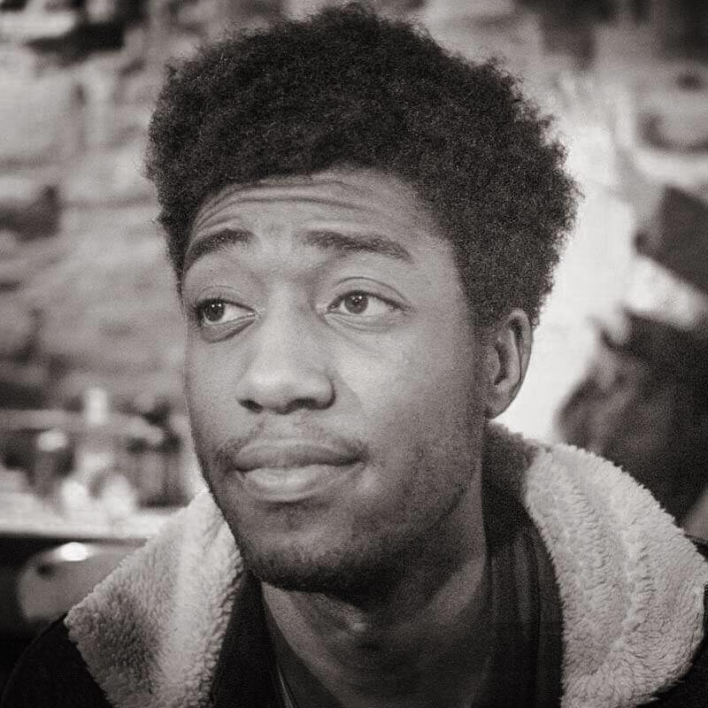

    

<figure>
        
		<figcaption>Louis 'Lou Kai' Ojuroye</figcaption>
</figure>

## About Me
This is where it all begins. I make games, sometimes I program, sometimes I dabble in writing and other times I love getting behind a bit of design work.
When I'm not doing that, my spare time resides in cultural activities and social gatherings every now and then

Studying at UWE, on the Games Technology degree. Before that I was part of a tech team in web design and development. 
I grew up with games and it was the best part of my childhood when I wasn't so driven by doing every sport I possibly could.

For any further information you'd like to hear or discover, please click the link below in order to do so.
      
[Contact Me](https://github.com/Levie){: .btn}
